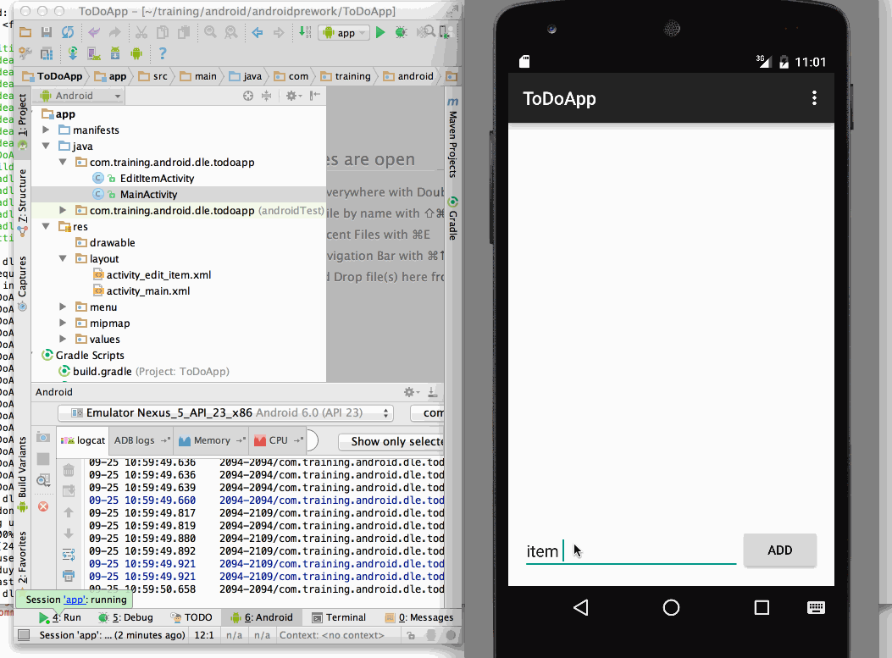

## To Do App Android Prework Training

```
This is a to do list Android application.  It allows the user to manage
his/her to do list.  It will save the content automatically.

```

Time spent: `3`

### Features

```
- Add new task to to do list
- Remove task from the list
- Edit list item
- Automatically save lists

```

#### Required

- [x] Successfully add and remove items
- [x] Support for editing todo items
- [x] support persist todo items 


### Walkthrough

